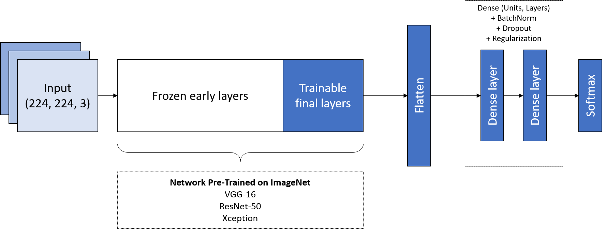

# vision_AQI_prediction

This is the code repository for the paper _Vision-Based Approaches to Air Quality Prediction_ .

Given the numerous models under consideration and the modular data downloading process, we present our code through interactive Jupyter notebooks.

## Overview
The root directory features our two best models.

### Tuned SVM
Our best pixel-level model was a tuned linear SVM. The code to reproduce this model is found in `final_SVM_modeling.ipynb`.

### Pre-Trained CNN

Given our small dataset size, we turned to pre-trained networks to aid our classification task. To this end, we leveraged Xception with a fully-connected classification module. This is our best-performing model; the code to reproduce the model is in `final_CNN_modeling.ipynb`.

## Procedure
### 1. AQI Data
First, go to the `aqi_data` folder and follow the instructions within to download the air quality data from the U.S. EPA's datasets for air quality in the Los Angeles metropolitan area.

### 2. Image Data
Next, download the image data by iterating through the notebooks in the `img_data` folder. The images are ordered via the `Planet.com` API.

### 3. Experiment
Our final tuned SVM and CNN were found via extensive hyperparameter searches. We were able to execute all of our code using Google Colab instances. Records of our experimentation are found in the `experiments` folder.